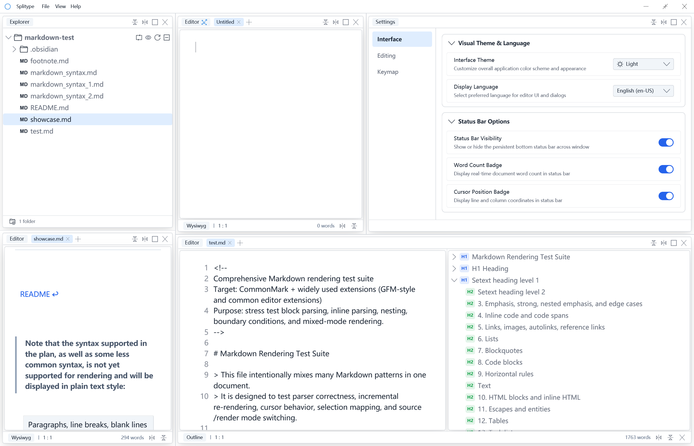
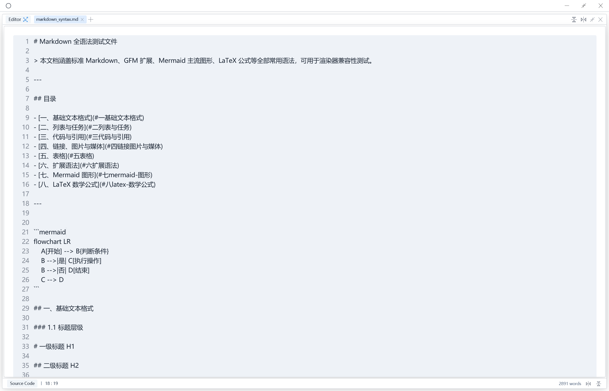
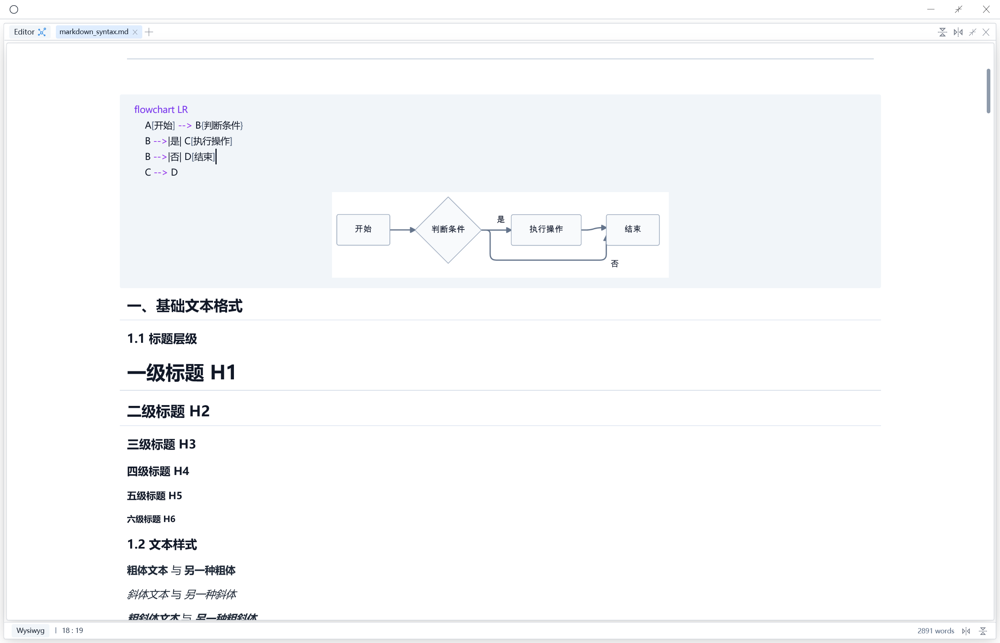
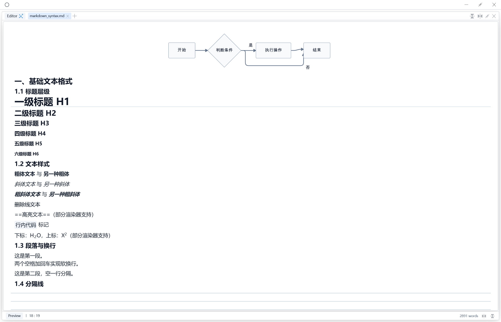

<p align="right">
  <a href="README.md">English</a> |
  <a href="docs/README.zh-CN.md">中文</a>
</p>

<h1 align="left">
  Splitype
</h1>

<p align="center">
  
</p>

<h3 align="right">
  A fast, native Markdown editor, built with Rust and GPUI.
</h3>

<p align="right">
    <a href="./assets/showcase/showcase.md">Showcase</a> | 
    <a href="https://github.com/hengvvang/splitype/discussions/1">Roadmap</a> | 
    <a href="https://github.com/hengvvang/splitype/wiki">Wiki</a>
</p>


## Features

### Split editing
> Splitype's split layout lets you build your own dedicated workspace exactly the way you like it.

|       SPLIT                     |
| -------------------------------- |
|  | 

### Multi-modal editing
> Splitype offers two workflows: split-preview editing and live WYSIWYG editing.

| Source editing                 | WYSIWYG editing                |              Preview           |
| -------------------------------- | --------------------------------- | -------------------------------- |
|  |  |  |


## Quick Start

### Download a prebuilt release
Grab the build for your platform from the [Releases](https://github.com/hengvvang/splitype/releases) page:
- **macOS**: a `.app` bundle or a `.pkg` installer (the installer also sets up the `splitype` CLI command).
- **Windows**: download the archive for your platform and run it directly after extracting.
- **Linux**: download the archive for your platform and run it directly after extracting.

### Build from source

Make sure the Rust toolchain (Edition 2024) is installed, then run:

```bash
git clone https://github.com/hengvvang/splitype.git
cd splitype
cargo build --release
```

The compiled binary is located at `./target/release/splitype`.


## Acknowledgements

- Special thanks to the [velotype](https://github.com/manyougz/velotype) project and its author for the original codebase that made this project possible.
- Special thanks to the [zed](https://github.com/zed-industries/zed) project and its authors for the base codebase — splitype largely ports zed's explorer design.
- Special thanks to the [blender](https://github.com/blender/blender) project and its authors for the base codebase — splitype's split layout design is inspired by blender.
- Special thanks to [dreamstale](https://www.flaticon.com/authors/dreamstale) for designing the icons; splitype is licensed to use them from [flaticon](https://www.flaticon.com/). Any individual or organization is strictly prohibited from downloading or using them without a proper license!

## License

splitype is licensed under the [Apache License 2.0](LICENSE-APACHE).
