# Showcase

    <a href="../../README.md">README ↩️</a>

> **Note that the syntax supported in the plan, as well as some less common syntax, is not yet supported for rendering and will be displayed in plain text style:**

| Headings |
| -------- |
|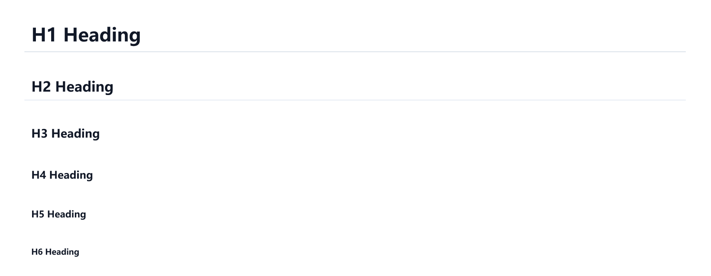                           |

| Emphasis, strong, nested emphasis, and edge cases |
| ------------------------------------------------- |
|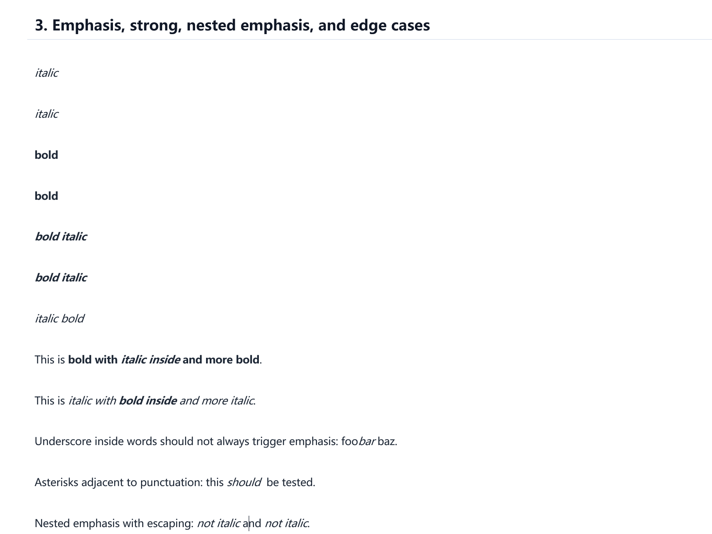                                        |

| Inline code and code span |
| ------------------------- |
|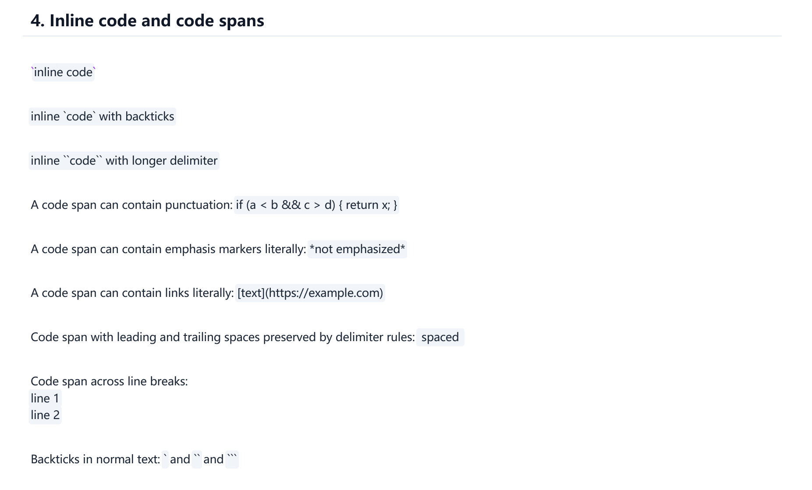                |

<!--| Links, images, autolinks, reference links |
| ----------------------------------------- |
|                                |-->

| Lists |
| ----- |
|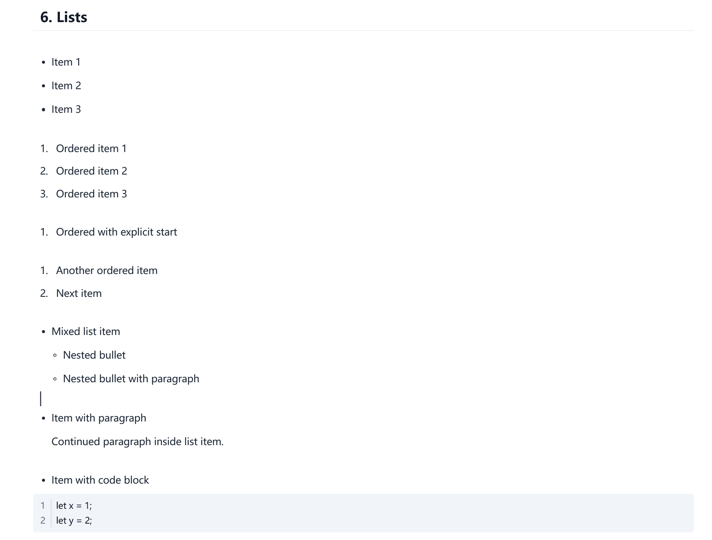    |

| Blockquotes |
| ----------- |
|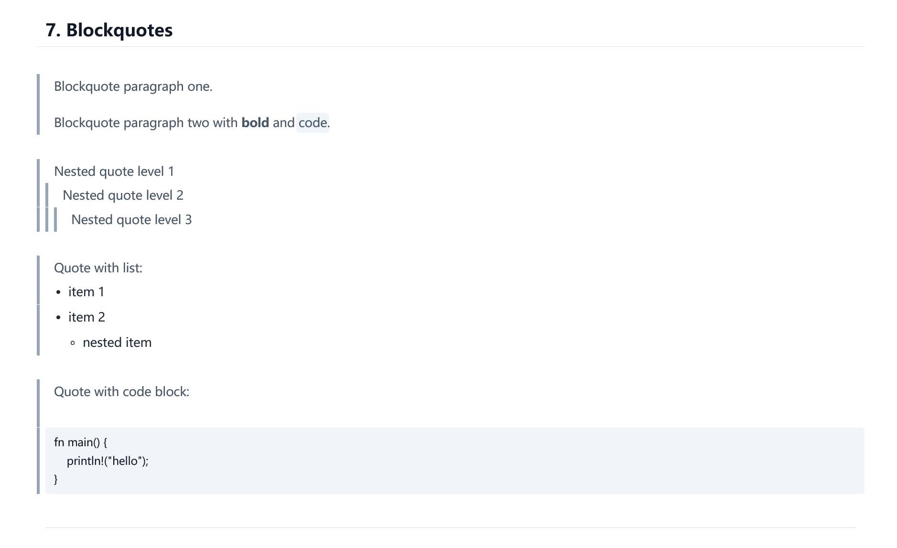  |

| Code blocks |
| ----------- |
|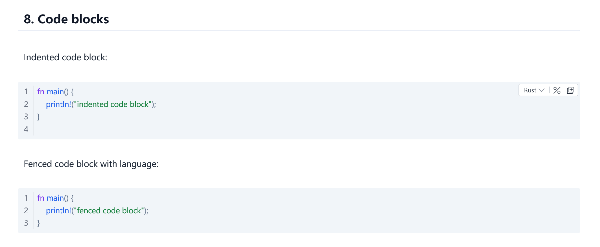    |

| Table block |
| ----------- |
|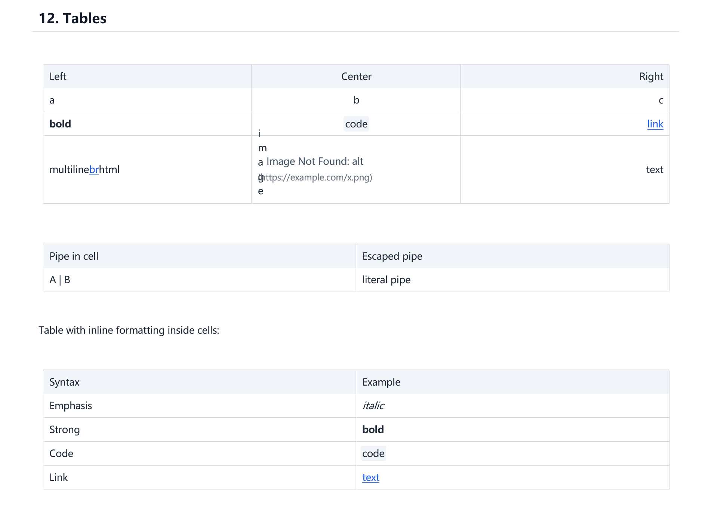 |

| Task lists |
| ---------- |
| |

| Footnotes |
| --------- |
|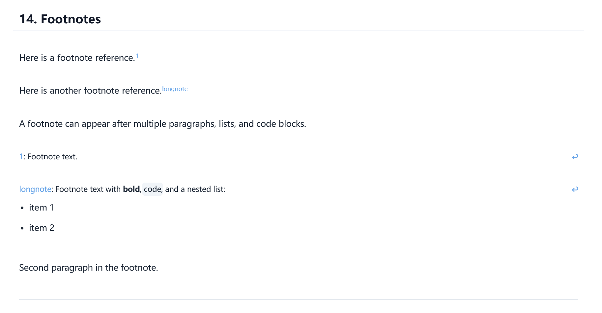 |

| Strikethrough |
| ------------- |
|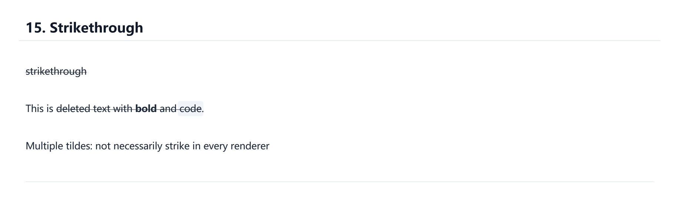  |

| Superscript and subscript style |
| ------------------------------- |
|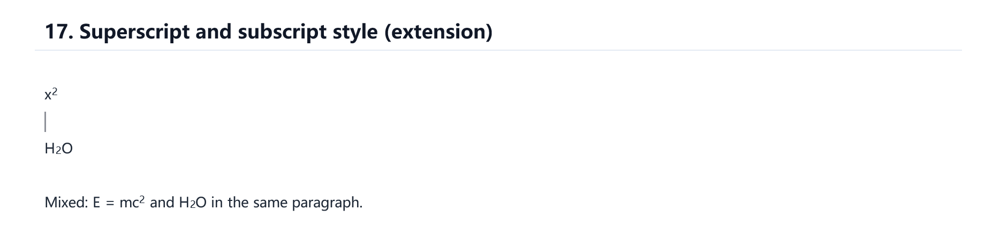                    |

<!--| Emoji and mention style |
| ----------------------- |
|            |

> Tip: The Emoji index has not been created, but directly entering Emoji characters is supported for rendering.-->

| Math style (LaTeX) |
| ------------------ |
|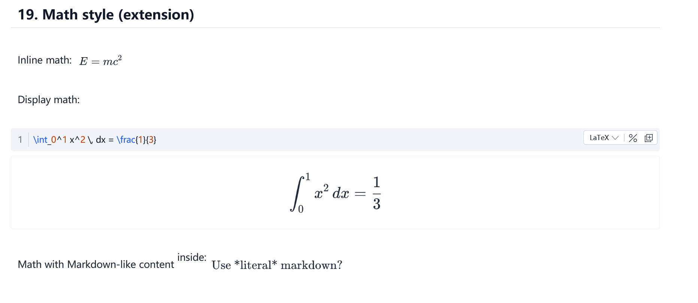       |

| Callout style |
| ------------- |
|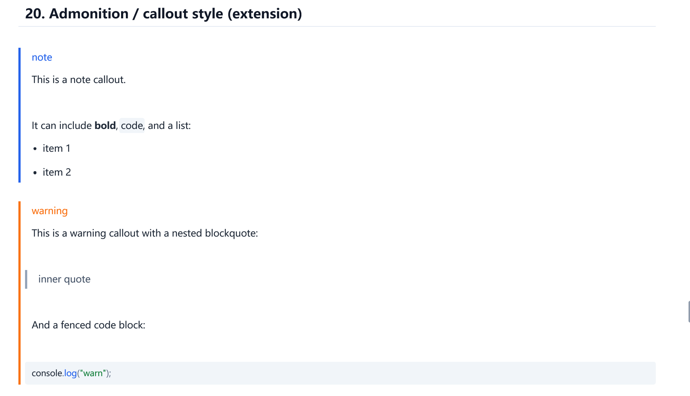  |
