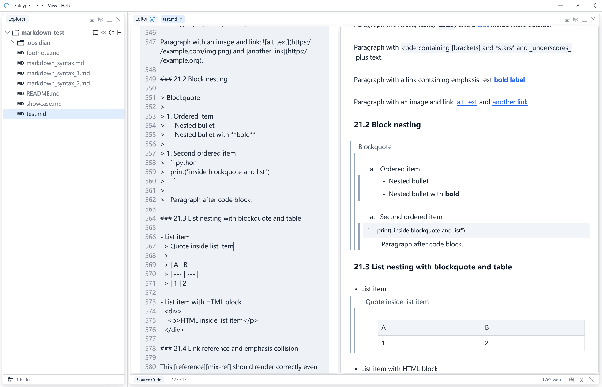
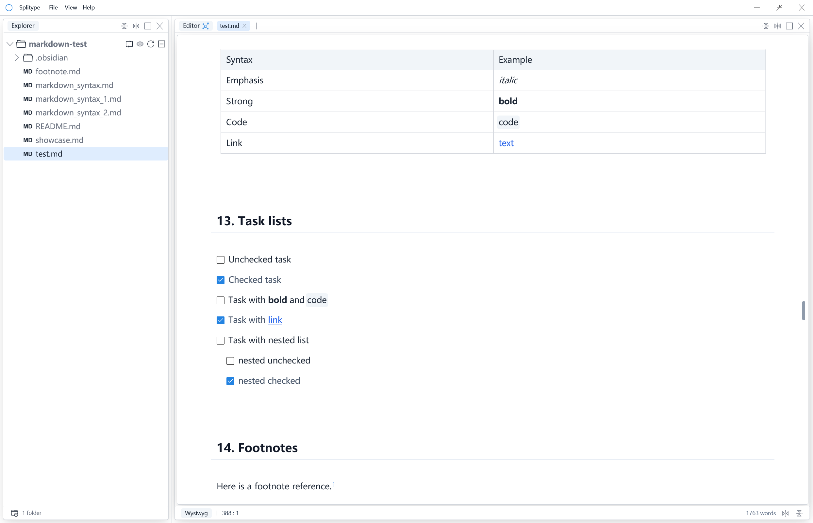

<p align="right">
  <a href="README.md">English</a> | <a href="docs/README.zh-CN.md">中文</a>
</p>

<h1 align="left">
  Splitype
</h1>

<p align="center">
  
</p>

<h3 align="right">
  A fast, native Markdown editor, built with Rust and GPUI.
</h3>

<p align="right">
    <a href="../assets/showcase/showcase.md">Showcase</a> | 
    <a href="https://github.com/hengvvang/splitype/discussions/1">Roadmap</a> | 
    <a href="https://github.com/hengvvang/splitype/wiki">Wiki</a>
</p>


## 特性

### 分屏编辑
> Splitype的分屏功能允许你根据你的喜好自由打造自己的专属工作区
>
> |       SPLIT                     |
> | -------------------------------- |
> |  |

### 多模态编辑
> Splitype 分屏预览编辑和实时编辑两种工作流
>
> | 分屏编辑                         | 所见即所得编辑                   |
> | -------------------------------- | -------------------------------- |
> |  |  |


## 安装

前往 [Releases](https://github.com/hengvvang/splitype/releases) 页面下载适用于你平台的最新版本。

### macOS

| 格式 | 说明 |
| ---- | ---- |
| `.app` | 独立应用包，拖入 `/Applications` 即可安装。 |
| `.pkg` | 系统安装器，安装应用的同时会将 `splitype` CLI 命令注册到 `PATH`。 |
| `.dmg` | 磁盘映像，包含 `.app` 应用包。打开后拖入 `/Applications`，然后推出磁盘。 |

### Windows

| 格式 | 说明 |
| ---- | ---- |
| `.zip` | 便携压缩包，解压到任意文件夹后直接运行 `splitype.exe`，无需安装。 |
| `.msi` | Windows 安装包，双击安装并创建开始菜单快捷方式，可选注册 `PATH`。 |

### Linux

| 格式 | 说明 |
| ---- | ---- |
| `.tar.gz` | 便携压缩包，解压后直接运行 `./splitype`，无需安装。 |
| `.deb` | Debian/Ubuntu 安装包，通过 `sudo dpkg -i splitype_*.deb` 安装。 |
| `.AppImage` | 单文件可执行程序，`chmod +x` 后直接运行，无需解压。 |

### 从源码构建

需要 [Rust](https://rustup.rs/) 工具链（Edition 2024）。

```bash
git clone https://github.com/hengvvang/splitype.git
cd splitype
cargo build --release
```

编译产物位于 `./target/release/splitype`。


## 致谢

Splitype 的诞生离不开以下优秀的开源项目：

- [velotype](https://github.com/manyougz/velotype) — 本项目的原始代码库，奠定了 splitype 的基础。
- [zed](https://github.com/zed-industries/zed) — splitype 的文件资源管理器大量移植自 zed 的设计。
- [blender](https://github.com/blender/blender) — splitype 的分屏布局系统受 blender 工作区模型启发。

**资产与资源**

- 图标由 [dreamstale](https://www.flaticon.com/authors/dreamstale) 设计，经 [Flaticon](https://www.flaticon.com/) 授权使用。未经授权，严禁任何个人或组织私自下载或使用。
- [Lexend](https://fonts.google.com/specimen/Lexend) 字体由 [Thomas Jockin](https://github.com/ThomasJockin) 设计，基于 [SIL Open Font License 1.1](http://scripts.sil.org/OFL) 许可发布。


## 开源许可

Splitype 基于 [GNU 通用公共许可证 3.0 或更新版本](../LICENSE-GPL)（[GPL-3.0-or-later](https://www.gnu.org/licenses/gpl-3.0.html)）发布。

部分内置资产适用其自身的许可协议：
- 图标：经 [Flaticon](https://www.flaticon.com/) 授权使用 — 详见[致谢](#致谢)。
- Lexend 字体：[SIL Open Font License 1.1](http://scripts.sil.org/OFL)。
