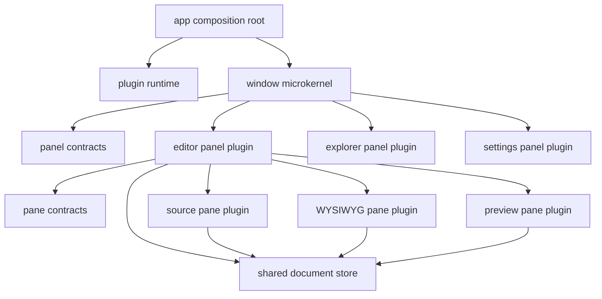
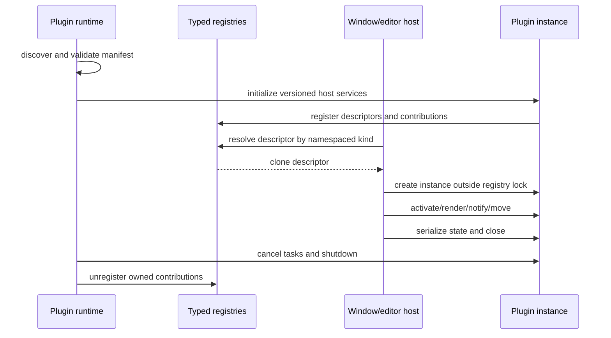

# Splitype architecture

## Status and scope

Splitype is moving from a set of statically linked extension points to a plugin
platform. These are deliberately different claims:

- **Built-in plugin**: a normal Rust crate linked by `app` and registered at the
  composition root.
- **Source plugin**: a third-party crate compiled against the exact Splitype SDK
  and GPUI revision, then linked into a distribution.
- **Runtime plugin**: an independently distributed package discovered and loaded
  without recompiling Splitype.

The current Rust trait contracts support built-in and source plugins. They are
**not a stable runtime ABI**. Rust trait objects, `Any`, GPUI objects, and Rust
containers must never cross a native dynamic-library boundary. A runtime plugin
system must use a versioned process/WASM protocol, or a deliberately versioned C
ABI that does not expose GPUI. Native in-process plugins are trusted code with
all host permissions and cannot be sandboxed reliably.

## Architectural objective

The application is a composition root around two nested microkernels:



Arrows represent compile-time or injected-service dependencies. The contracts
layer must not depend on concrete editor, pane, explorer, settings, or app
implementations. `app` is the only crate allowed to know the complete built-in
plugin set.

## Non-negotiable dependency rules

1. `app` chooses the product's default plugins and layout. Explicit registration
   in the composition root is policy, not kernel hardcoding.
2. `window` operates only on `PanelKind`, `PanelDescriptor`, `PanelView`, and
   declared capabilities. It must not compare against `"editor"`, `"explorer"`,
   or `"settings"`, and must not downcast to their concrete views.
3. `editor` operates only on pane contracts and document services. It must not
   import `pane_source_code`, `pane_wysiwyg`, or `pane_preview`.
4. Pane implementations may depend on shared parser, syntax, theme, and document
   APIs, but never on `editor` or another pane implementation.
5. Parser/domain crates must not contain GPUI entity IDs or modes named after a
   pane. Parsing policy is domain vocabulary, not product vocabulary.
6. Application globals contain true process-wide services only. Focus, selection,
   dropdown, drag, and transient UI state belong to a pane/panel instance.
7. A registry lock protects registry data only. Descriptor and plugin callbacks
   are always invoked after releasing the lock.
8. Registration conflicts are errors. Silent replacement is forbidden. Runtime
   IDs must eventually be owned, namespaced values such as
   `dev.splitype.editor` and `com.example.diagram`.

## Ownership model

### Application scope

Owns plugin discovery, trust decisions, shared settings, theme/language services,
asset resolution, telemetry policy, and process-level infrastructure.

### Window scope

Owns panel topology, focus/activation, docking, maximize state, close protocol,
and persisted window layout. It invokes every panel lifecycle callback uniformly.

### Panel instance scope

Owns the panel's transient UI state and optional panel model. A panel instance
receives a mandatory host handle and services; it does not locate the shell via a
global singleton.

### Editor/document scope

The editor owns tabs and the authoritative document state. A document is exposed
to panes as an immutable `DocumentSnapshot` containing identity, revision, text,
path, and base directory. A future `DocumentResourceProvider` will provide
controlled access to relative resources. Panes submit edits; they do not mutate a
second authoritative copy.

### Pane instance scope

Owns projection-specific state: source selection, WYSIWYG block entities,
preview layout, local scroll anchors, and caches. Multiple instances of the same
kind must be independent.

## Plugin lifecycle

The target lifecycle is:



Every fallible stage returns structured errors. Missing or disabled plugins are
represented by recoverable placeholder views that preserve serialized state.
They must not panic the process.

## Pane contract direction

`DocumentSnapshot` is the input boundary. The mutation boundary should converge
on one operation:

```text
commit_document_edit(base_revision, edit) -> CommitOutcome
```

The editor alone increments revision, updates dirty state, invalidates caches,
and broadcasts the next snapshot. Calling `sync_source_text` followed by a
separate `mark_dirty` is transitional and must be removed.

Optional behavior must be explicit. Default no-op methods are not capability
negotiation. The target API exposes capabilities or typed providers for editing,
search, outline, navigation, export, and serialization. Unsupported operations
must not mark a document dirty.

Export is a document contribution, not an editor implementation detail and not
implicitly owned by whichever pane happens to be visible. Exporters register by
an extensible format ID.

## Panel contract direction

Panels reach the shell through three contract seams, each one-way and
role-scoped:

- document-routing panels call back through [`DocumentHost`];
- the shell pushes document context and sidebar commands into sidebar
  panels through [`SidebarPanel`];
- layout mutations (split, close, maximize, kind switch) from panel chrome
  are dispatched as shell-owned `window::actions`.

There is no generic PanelHost: the shell materializes panels through the
registry, applies the same lifecycle to all panel kinds (activation and
focus; split, dock, swap, move, and panel ID changes; dirty inspection,
save, discard, and close; filesystem notifications; clone/suspend/restore
where capabilities declare support; versioned state serialization), and
panels pick the seam that matches their role.

Container chrome (split, close, maximize, kind selector) belongs to the shell.
Panels contribute metadata and optional actions, then render their body. A panel
must not duplicate host chrome or dispatch undocumented shell actions to replace
a missing host protocol.

## Persistence

Runtime layout types and persisted DTOs are separate. Persisted data is versioned
and contains owned strings:

```text
PersistedWindow
  version
  split tree
  active panel
  panels[] { instance_id, kind, plugin_version, opaque_state }
```

A descriptor owns migration of its opaque state. Unknown state is retained
verbatim so reinstalling a plugin can recover it. Transient drag, menu, focus,
and viewport data is never persisted.

## Resource and security boundary

Plugin resources use namespaced handles such as
`plugin://com.example.diagram/icons/panel.svg`; logical kind IDs are not asset
paths. The host resolver validates package roots, size, format, caching, and
path traversal.

Runtime plugins require an explicit trust model:

- never auto-load native code from a workspace;
- distinguish bundled, system, user, and workspace packages;
- record package origin, hash/signature, API range, and enabled state;
- prefer a subprocess or WASM boundary for untrusted computation;
- grant filesystem, network, process, and clipboard capabilities explicitly;
- isolate cancellation, timeout, crash, and resource accounting.

## Anti-pattern gate

A change fails architecture review if it introduces any of these outside the
composition root or plugin implementation itself:

- comparison with a built-in kind string;
- downcast to a built-in pane or panel type;
- plugin callback while holding a registry mutex;
- silent duplicate registration;
- pane/panel instance state stored as an application global;
- default no-op interpreted as a successful mutation;
- direct relative-resource resolution without document context;
- a Rust/GPUI trait object advertised as a stable dynamic ABI;
- persisted `&'static str` plugin identifiers;
- kernel-owned Markdown syntax commands or format-specific exporters.

These rules should become automated dependency and source checks once the
transitional hardcoding listed below is removed.

## Audit of the current codebase

### What is structurally sound

- Built-in implementations are separate crates.
- `editor` does not depend on the three concrete pane crates.
- `window` does not depend on concrete panel crates.
- Split trees are generic over pane/panel kind.
- Pane and panel descriptors are registered in `app`.
- Registry factories now run after the global mutex is released.
- Duplicate pane/panel kinds now fail registration.
- Panel moves now notify every view through `PanelView::set_panel_id`.
- All panes now receive a shared `DocumentSnapshot`; Preview and WYSIWYG receive
  the authoritative document base directory.
- Window and panel close protection resolves dirty state through
  `PanelView::is_dirty`/`first_dirty_title`; the editor-specific retained
  session check only covers suspended editor documents.
- Panel geometry, activation, maximized, and leaf counts reach panels through
  `PanelRenderContext`; the shell no longer downcasts to push editor layout
  state. Inner drag and filesystem rename notifications use generic
  `PanelView` hooks.
- Panel kind switches use a generic suspend/restore protocol
  (`PanelView::suspend_state`/`clone_state`,
  `PanelDescriptor::restore_panel`/`retained_dirty_info`/`discard_retained`)
  and `Shell::retained_panel_states`. Editor document sessions participate
  as ordinary plugin state; the shell no longer owns an editor-specific
  session retention mechanism.
- Host-driven pane commands (`replace`, `apply_*`) return the new authoritative
  text and the editor commits it once; spontaneous pane edits commit through
  `PaneHost::sync_source_text`, which bumps the revision and marks the document
  dirty in a single atomic step. `PaneHost::mark_dirty` is gone, and read-only
  panes no longer produce phantom dirty state.
- The Settings panel owns its `SettingsUiState` as a per-panel entity created
  by its descriptor; splitting the settings panel now yields independent
  instances, and the app bootstrap no longer installs a settings global.
- The Explorer panel owns an `Entity<ExplorerState>` per instance and
  restores/clones it through the generic suspend/clone protocol; the shell
  routes active-file sync, drawer toggles, and menu rendering to every
  explorer instance instead of a shared app global.
- The sidebar role is a contract, not an explorer privilege:
  `SidebarPanel` (`set_active_document_path`, `on_document_path_changed`,
  `toggle_drawer`, `close_active_folder`) plus generic overlay hooks on
  `PanelView` (`render_overlay`, `dismiss_overlays`). The explorer renders
  its own row context menu as a panel overlay; the shell pushes document
  context and sidebar commands through the trait and no longer imports any
  explorer type outside the composition root. The explorer's
  `UpdateOpenTabPaths` action moved to `window::actions` so panels emit
  shell vocabulary instead of the shell consuming plugin vocabulary.
- Window state is persisted through the `restore_window_state` setting:
  the shell snapshots the layout topology (a serde projection of the split
  tree with transient interaction sessions skipped) plus per-panel plugin
  state on close, writing a versioned `window_state.json`. Panels opt into
  state persistence via `PanelDescriptor::serialize_state`/
  `deserialize_state`; the editor persists its full session (tabs, text,
  dirty flags, pane layout kinds), while non-opting panels restore fresh.
  Startup restores the snapshot when enabled and the schema version matches.
  Explorer and Settings panels opt in too: the explorer persists its drawer
  visibility and open folder paths (worktrees re-scan from disk on restore),
  and settings persists its active tab.
- Plugins are declared through versioned TOML manifests
  (`PluginManifest`: reverse-domain `PluginId`, entry point, declared pane
  and panel capabilities, resource roots) and recorded in a global
  `PluginRegistry`. The composition root discovers bundled manifests and
  maps their in-process registration keys to descriptor factories — the
  only place allowed to know concrete plugin types — then registers
  descriptors into the pane/panel registries after validating every kind
  against the manifest. `plugin://<id>/<path>` resource URLs resolve
  through the owning manifest's `resources.icon_root` into the asset
  catalog, and panel icons now flow through that namespace (visible in the
  the panel-kind dropdown).
- Commands are plugin contributions: manifests declare `[[commands]]`
  (plugin-local id, menu skeleton location, default shortcut), a global
  `CommandRegistry` records them, and the menu bar assembles its static
  items from the registry through a menu skeleton. The composition root's
  command binding table maps each command id to its localized label and
  concrete action — the only place allowed to know action types. Dynamic
  sections (recent files, themes, languages, CLI tool) remain composition-
  root providers.
- Missing plugins degrade gracefully: a layout leaf whose kind has no
  registered descriptor gets a shell-rendered `MissingPanelView` placeholder
  that keeps the layout intact and names the owning plugin through the
  plugin registry. User-installed manifests under the config `plugins/`
  directory are discovered, validated, and recorded as metadata (code
  transports are not implemented yet), so unknown kinds can still be named.
- Document routing is a panel role, not an editor privilege:
  `PanelCapabilities { documents, sidebar }` is declared by descriptors and
  views, and panels that declare `documents` implement the `DocumentPanel`
  trait. The shell routes file opens, tab save/close/discard, dirty dialogs,
  drop replacement, focus, and save/export entirely through
  `dyn DocumentPanel` (opt-in downcast hooks on `PanelView`); it no longer
  downcasts to `EditorPanelView` or compares `"editor"` kind strings. Menu
  actions dispatch to panels by `PanelId`, and the default window layout is
  derived from registry capabilities.
- `EditorHost` is renamed `DocumentHost` (with `on_document_path_changed`
  and `record_recent_file`); the shell hands it to any document panel via
  `DocumentPanel::attach_document_host`.
- The pane capability model is the single gate for optional behavior: every
  optional `PaneView` method documents the capability that gates it and
  hosts check that flag before calling, `PaneHost` exposes only the
  operations panes actually invoke (`sync_source_text`, outline
  navigation/hover, key/mouse event routing), and `PanelView` carries no
  dead lifecycle hooks — panels reach the shell through `DocumentHost`,
  `SidebarPanel`, or shell-owned actions, not a generic unused host.
- `core_contracts` no longer depends on `window` and carries no GPUI
  presentation: panel contracts (`PanelView`, `PanelDescriptor`,
  `PanelKind`, `PanelId`, `PanelRenderContext`) live in `core_contracts::panel`,
  the outline HUD / search panel renderers moved to the `ui` crate, and
  `window` hosts the panel registry without re-exporting contract types —
  every consumer imports them from `core_contracts` directly. Built-in kinds
  are namespaced (`splitype.pane.wysiwyg|source_code|preview`,
  `splitype.panel.editor|explorer|settings`) and built via `from_static`;
  `panel_topbar_icon` takes a plugin-owned icon prefix instead of deriving
  paths from kind strings. Both window open paths (`open_editor_window`,
  `open_cloned_window`) create every panel through the registry.
- The codebase keeps a single canonical path per item: crate roots no longer
  re-export foreign contract types, plugin crates expose their descriptor as
  the only root-level entry point, `markdown_parser` addresses its model as
  `parse::*` (the `parse::parser` nesting and GPUI `EntityId` identity are
  gone), and `pane_wysiwyg` addresses `markdown_parser`/`syntax_highlighter`
  directly instead of through re-export facades (its contract adapter lives
  in `pane_wysiwyg::pane`). The editor aggregate keeps action dispatch
  handlers in `editor::actions` while state mutations live in the session /
  navigation modules.

### Remaining critical migration work

1. External plugin code loading is not implemented yet: no WASM/subprocess
   transports, permission model, unregister/shutdown protocol, or
   `AssetSource::list` directory listing — user manifests are metadata-only
   today.
2. Keybindings are still driven by the config `ShortcutCommand` vocabulary
   rather than manifest-declared shortcuts, and GPUI's typed
   `cx.on_action` API requires per-command dispatch handlers in the
   composition root (command table + handlers must be kept in sync). Panel
   topbar chrome is duplicated per plugin; consider a shared chrome
   renderer driven by descriptor metadata.
3. Per-pane view state (cursor, scroll, selections) is not persisted, and the
   explorer restores folder roots without their expansion state.
4. Preview pane selection rendering exists but no input is routed to it, and
   the editor's autoscroll execution is still a stub.
5. `markdown_parser` still carries consumer-specific parse modes
   (`ParseMode::Wysiwyg`/`Preview`); replace them with a recursive parse
   policy owned by the domain.
6. Preview pane selection rendering exists but no input is routed to it, and
   the editor's autoscroll execution is still a stub.

## Migration plan and acceptance criteria

### Phase 1 — trustworthy in-process source plugins

- Make IDs owned and namespaced.
- Replace globals with app-owned registries and service injection.
- Add mandatory pane/panel create contexts and structured factory errors.
- Implement capabilities, atomic document commits, close protocol, and per-instance
  Explorer/Settings state.
- Remove all built-in type checks from shell/editor kernels.
- Add fake third-party pane/panel integration tests.

Acceptance: a test-only plugin crate can register, create multiple independent
instances, split/dock/move, edit or remain read-only, save/close safely, and clone
or report unsupported cloning without modifying kernel code.

### Phase 2 — persistence and complete contribution model

- Versioned window/panel/pane state DTOs and missing-plugin placeholders.
- Commands, menus, keybindings, exporters, settings schemas, and resources become
  typed contributions.
- Plugin lifecycle owns tasks and cleanup.

Acceptance: disabling a plugin preserves layout/state, restarting restores it,
and reinstalling recovers the original instance.

### Phase 3 — runtime package platform

- Choose WASM or subprocess protocol for untrusted plugins.
- Publish manifest schema, semantic API ranges, capability grants, package signing,
  and compatibility tests.
- Keep GPUI-native source plugins as a separately documented trusted tier.

Acceptance: an independently packaged plugin can be discovered, validated,
enabled, disabled, upgraded, and fail without corrupting registry or document
state.
